# BhutanMart

A production-ready e-commerce platform built with MongoDB and Redis as part of the DBS302 assignment. The project demonstrates polyglot persistence — MongoDB as the primary document store and Redis as the in-memory layer for caching, sessions, real-time features, and analytics.

## Tech Stack

| Layer      | Technology |
|------------|-----------|
| Frontend   | React 19, Vite, React Router v6, Axios |
| Backend    | Node.js, Express 5 |
| Primary DB | MongoDB (Atlas replica set — 3 nodes) |
| Cache / RT | Redis 6 (Sorted Sets, Hashes, HyperLogLog, Lists, Strings) |
| Auth       | JWT (jsonwebtoken) + bcryptjs |
| Logging    | Morgan (combined format) |
| Security   | Helmet, CORS, rate limiter middleware |

## Features

- User registration, login, JWT auth, and role-based access (Customer / Seller / Admin)
- Product catalogue with full-text search, filtering, sorting, and pagination
- Redis-cached product details (cache-aside with jittered TTL for stampede prevention)
- Shopping cart backed by Redis Hash (authenticated and guest cart)
- MongoDB ACID transactions for order placement with atomic stock decrement
- Real-time trending products leaderboard (Redis Sorted Set)
- Top buyers leaderboard by monthly spend (Redis Sorted Set)
- Recently viewed products per user (Redis List)
- HyperLogLog unique product page visitor counting
- Rate limiting on API endpoints (Redis counter with TTL)
- Seller profiles with leaderboard scores
- Analytics: daily/monthly revenue, top products, low-stock alerts, most-viewed vs most-purchased

## Local Setup

### Prerequisites

- Node.js ≥ 18
- MongoDB (local) or a MongoDB Atlas account
- Redis ≥ 6 running on `localhost:6379`

### 1. Clone the repository

```bash
git clone <repo-url>
cd BhutanMart
```

### 2. Configure environment variables

```bash
# Backend
cp .env.example backend/.env
# Edit backend/.env — set MONGO_URI, REDIS_URL, JWT_SECRET

# Frontend
cp frontend/.env.example frontend/.env
# Default VITE_API_URL=http://localhost:5000/api is fine for local dev
```

### 3. Install dependencies

```bash
cd backend && npm install
cd ../frontend && npm install
```

### 4. Seed the database

```bash
cd backend
npm run seed
```

This seeds: **10 users** (1 admin, 2 sellers, 7 customers), **5 categories**, **2 seller profiles**, **50 products**, and **20 orders**.

### 5. Start the application

```bash
# Backend (port 5000)
cd backend && npm run dev

# Frontend (port 5173)
cd frontend && npm run dev
```

Open `http://localhost:5173` in your browser.

## API Documentation

A Postman collection is available at `docs/api/BhutanMart_API_Collection.json`.

Import it into Postman and set the `base_url` variable to `http://localhost:5000`.

### Key endpoints

```
POST   /api/auth/register
POST   /api/auth/login
GET    /api/products                 (full-text search, filter, paginate)
GET    /api/products/:id             (cache-aside from Redis)
POST   /api/cart/add                 (Redis Hash — authenticated)
GET    /api/cart/guest/:guestId      (Redis Hash — guest)
POST   /api/orders                   (MongoDB transaction)
GET    /api/analytics/trending       (Redis Sorted Set)
GET    /api/analytics/leaderboard/buyers
GET    /api/analytics/revenue/daily
GET    /api/admin/redis-info         (Redis INFO stats + cache hit-rate)
```

## Working application

### 1. Landing Page

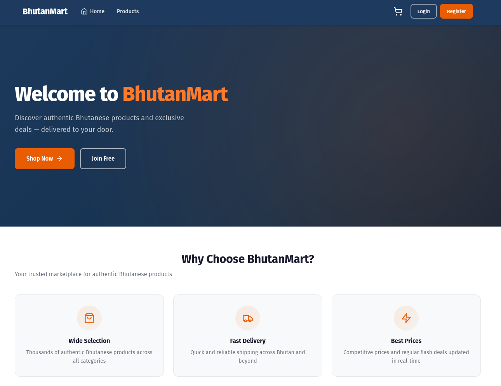

### 2. Admin Dashboard

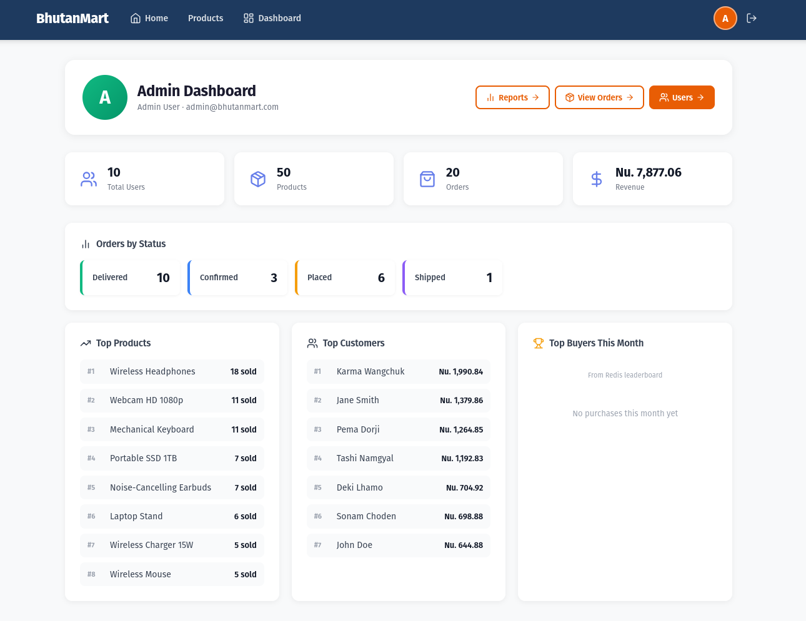

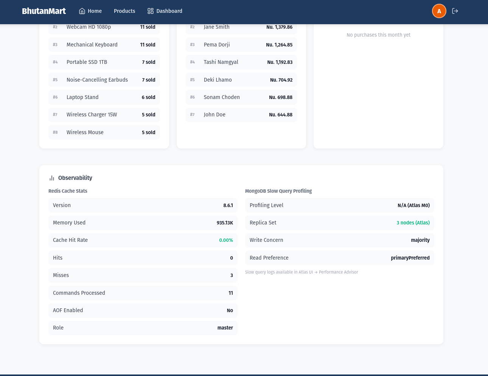

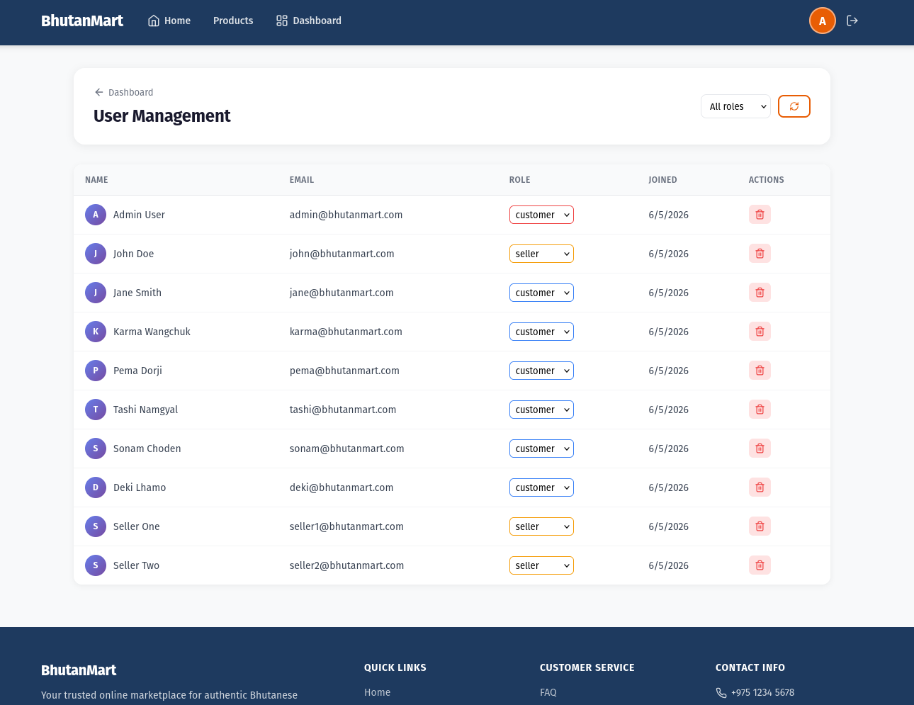

### 3. Seller Dashboard

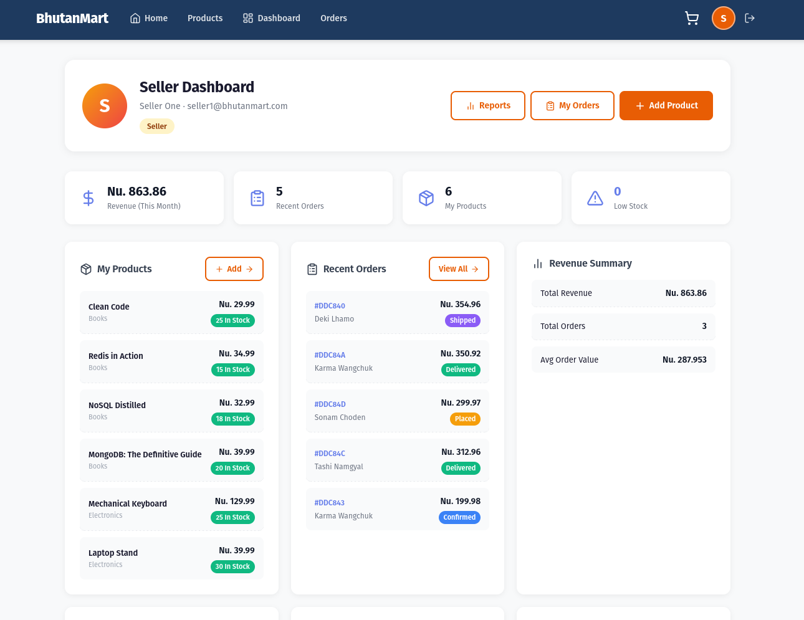

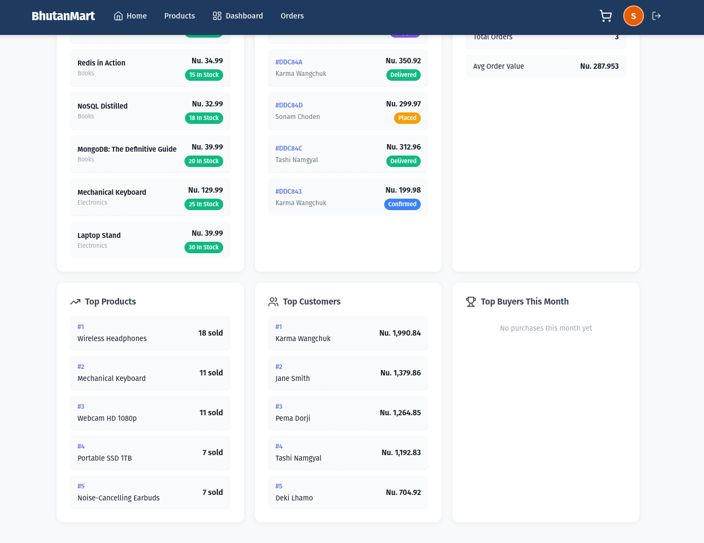

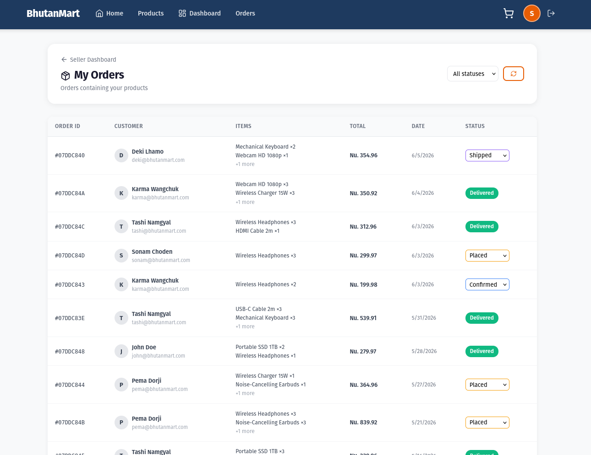

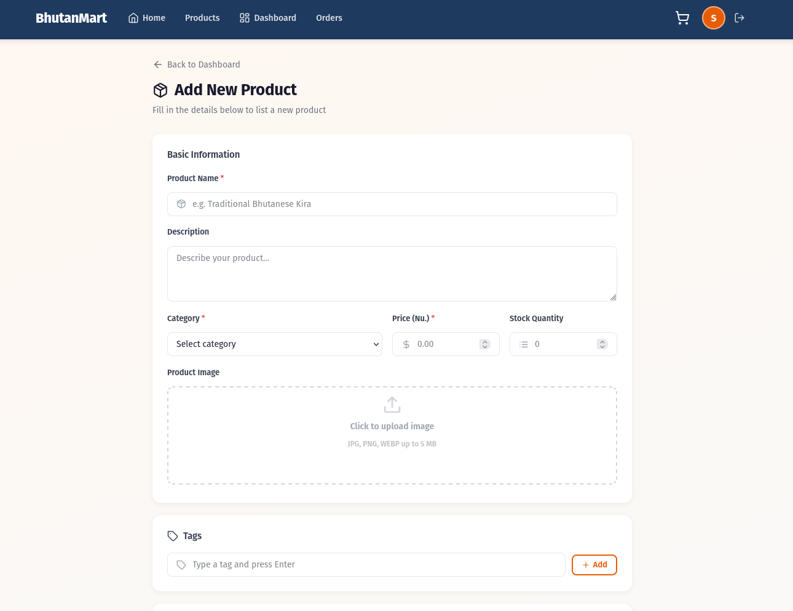

### 4. Customer Dashboard

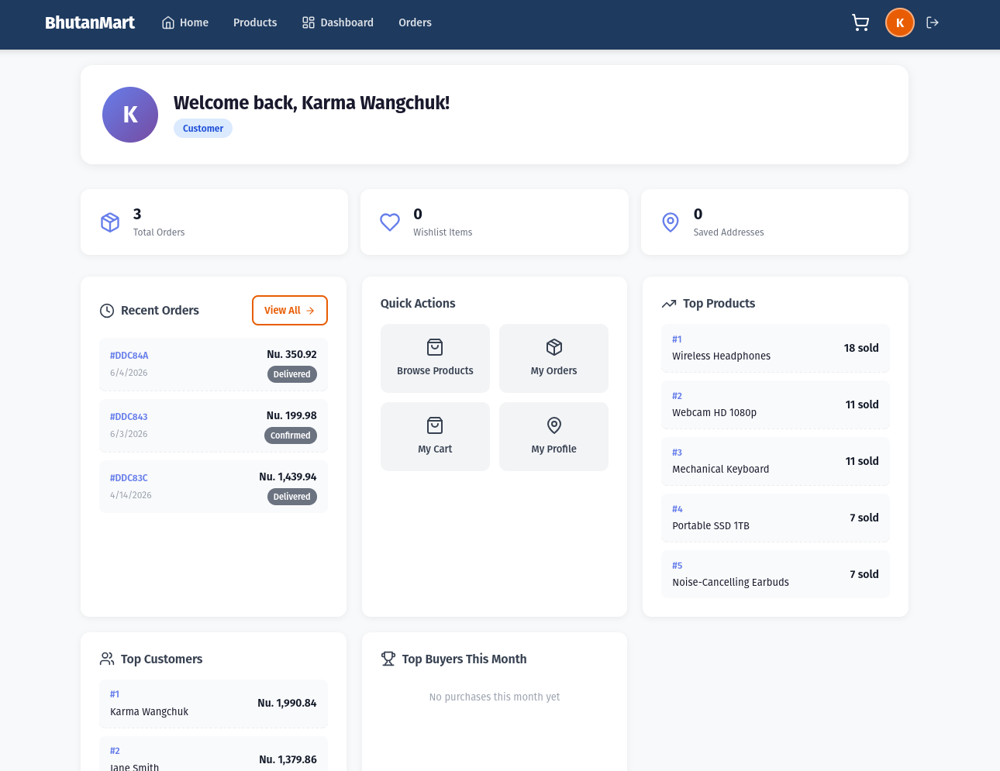

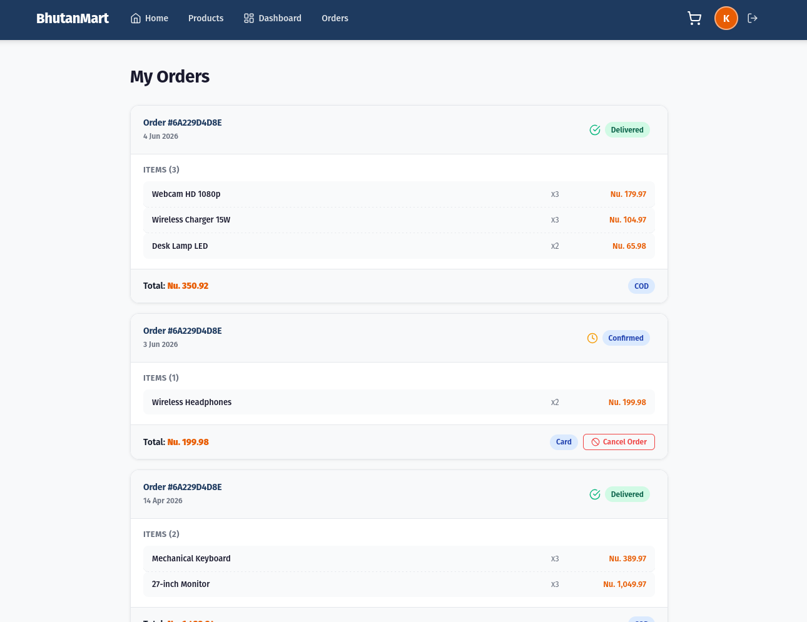

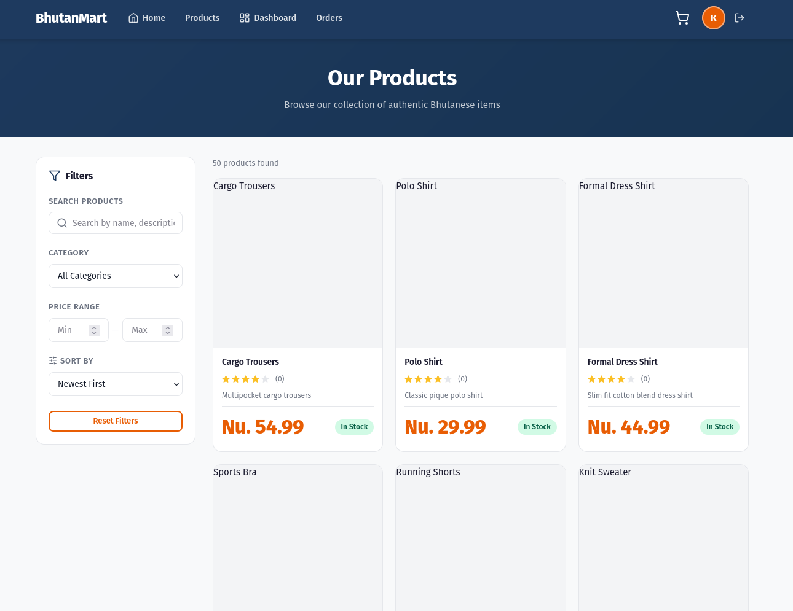
